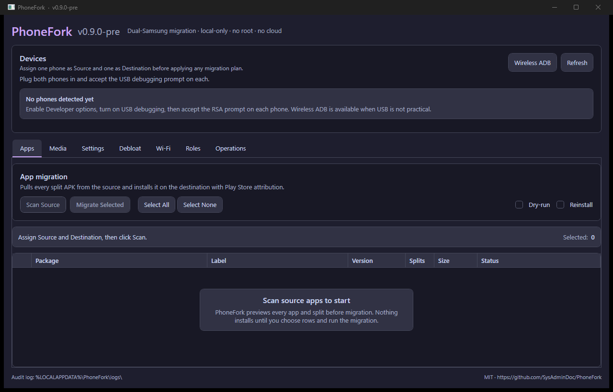

# PhoneFork

[](https://github.com/SysAdminDoc/PhoneFork/releases)
[](LICENSE)
[](#)
[](https://dotnet.microsoft.com/)

**Dual-Samsung Android migration tool for Windows.** Drives two USB-connected Galaxy phones at the same time and copies apps, media, settings, Wi-Fi, default app roles, and applies a debloat profile — from a new device to a freshly-reset old one. No root, no Samsung account, no cloud.

Built because Samsung Smart Switch is sequential (one phone at a time), one-direction-blessed (old→new), and refuses to debloat.

## What it does



| Domain | What gets copied | Mechanism |
|---|---|---|
| **Apps** | All `-3` user apps + their split APKs | `pm path` → `adb pull` → `pm install-create/-write/-commit -i com.android.vending --install-reason 4` |
| **Media** | DCIM, Pictures, Movies, Download, Documents, Music, Ringtones, Notifications, Alarms | Incremental manifest diff + `adb pull/push` |
| **Settings** | AOSP `secure`/`system`/`global` + reviewed safe Samsung One UI keys (AOD, edge panels, display, sound, navigation) | `settings list` snapshot diff + safety-corpus-gated `settings put` |
| **Debloat** | Apply [AppManagerNG](https://github.com/SysAdminDoc/AppManagerNG)'s 5,481-entry curated bloat list | `pm disable-user --user 0` (reversible) |
| **Wi-Fi** | Saved-network visibility where Android permits + QR-bridge fallback; helper-assisted PSK export is planned | `cmd wifi` / shell probes where available, or `WIFI:T=WPA;S=…;P=…;;` QR |
| **Roles** | Default dialer, SMS, browser, launcher, assistant | `cmd role add-role-holder` |

## What it cannot do (and why)

Third-party app **private data** (banking, messengers, game saves, login sessions) does not transfer. Android's security model prevents reading `/data/data/<pkg>/` without root, and `adb backup` was effectively neutered in Android 12. For app-data migration, run Samsung Smart Switch alongside PhoneFork as a complementary step.

Knox-bound data (Secure Folder, Samsung Wallet payment tokens, enterprise containers) is intentionally inaccessible by design — re-set those up on the destination.

For SMS, PhoneFork's pre-flight checks verify the default SMS role and the Samsung Messages -> Google Messages transition state before any helper-assisted SMS workflow.

For Samsung Gallery, pre-flight checks use Microsoft's September 30, 2026 direct OneDrive sync cutoff and verify OneDrive camera-backup prerequisites where Android exposes them.

## Android developer verification (Sept 2026)

Google's [developer verification](https://developer.android.com/developer-verification/guides/faq) requirement applies to **Play / sideload installs of unverified developers**. It does **not** apply to packages installed via ADB. PhoneFork's planned helper APK path uses `adb install`, so the verification gate is not on the critical path. If you sideload the helper outside ADB you may be prompted by your launcher to verify the developer; that is normal.

## Install

An unsigned prerelease is available under [Releases](https://github.com/SysAdminDoc/PhoneFork/releases). Build from source remains supported with the commands below.

Requires the **.NET 10 Desktop Runtime** ([download](https://dotnet.microsoft.com/en-us/download/dotnet/10.0)) — the zip is framework-dependent (~10 MB).

The bundled `tools/adb.exe` ships with the app — no Android SDK needed on your PC.

The current `v0.9.0-pre` ZIPs are unsigned. Future release ZIPs include
`ARTIFACT-TRUST.txt`, an SPDX SBOM, SHA-256 checksums, and GitHub artifact
attestations. When Azure Artifact Signing secrets are provisioned, PhoneFork
signs the Windows EXE/DLL payloads before ZIP packaging. Even signed releases
from a new publisher can still show SmartScreen warnings until reputation
builds.

## Usage

1. Plug **both** phones in via USB. Accept the "Allow USB debugging?" prompt on each.
2. Open PhoneFork. Both devices appear in the top bar; pick which is **Source** and which is **Destination**.
3. For wireless debugging, open **Wireless ADB** in the device bar, pair with the phone's pairing endpoint/code, then connect to the wireless ADB endpoint.
4. Open the tab for whatever you want to migrate. Each tab has a **dry-run** preview before **Apply**.
5. Audit log writes one NDJSON line per operation to `%LOCALAPPDATA%\PhoneFork\logs\audit-YYYY-MM-DD.log`.
6. Completed migration/apply flows write JSON receipts to `%LOCALAPPDATA%\PhoneFork\receipts`.

## CLI

```bash
phonefork devices                          # list connected
phonefork apps list --device R5CY34G070L   # enumerate user apps
phonefork apps report --device <serial> [--json]
phonefork apps migrate --from <src> --to <dst> [--dry-run] [--allow-multi-user]
phonefork media sync   --from <src> --to <dst> [--checkpoint path] [--report path]
phonefork settings dump --device <serial> --out settings.json
phonefork settings diff --src source.json --dst dest.json [--show-safety]
phonefork settings apply --from <src> --to <dst> [--allow-multi-user] [--include-uncatalogued-settings]
phonefork debloat apply --device <serial> --profile aggressive [--overlay-feed feed.json --overlay-sha256 <sha256>] [--allow-multi-user]
phonefork backup inspect <path> [--json]
phonefork backup export-appmanager --device <src> --out backups [--package <pkg>]
phonefork backup install-appmanager --to <dst> --backup <dir> [--dry-run] [--allow-multi-user]
phonefork pair <ip:pair-port> <code>
phonefork connect <ip:connect-port>
```

`apps report` explains per-app APK installability, private-data limits,
OBB/external-data payloads, and source/provenance posture so a user can see
what PhoneFork can and cannot transfer before wiping the source.

Package, settings, role, permission, appop, and backup-install writes are
primary-user-only by default. PhoneFork probes Android user/profile topology
first and refuses work-profile or secondary-user devices unless the CLI caller
explicitly passes `--allow-multi-user`; the WPF cockpit blocks those writes for
now.

Settings apply is corpus-gated. By default, PhoneFork applies only reviewed safe
Samsung/Android settings and reports review-only, blocked, and unknown keys in
the read-only diff. CLI callers can opt into non-blocked uncatalogued keys with
`--include-uncatalogued-settings`.

Receipts use hashed device IDs and include operation type, PhoneFork version,
category counts, failures, warnings, and rollback/evidence paths such as debloat
snapshots, media checkpoints, and media evidence reports.

Media sync resumes from the checkpoint JSON, writes an evidence report JSON, and emits Quick Share guidance only for single large ad hoc files where a full ADB sync is not the best tool.

Debloat overlay feeds are optional JSON hotfixes for OEM/package safety
changes. They must be verified with `--overlay-sha256` or a sibling
`.sha256` file; without an overlay, PhoneFork uses the embedded offline
AppManagerNG/UAD-NG dataset and bundled source-backed overrides.

## Build from source

```bash
git clone https://github.com/SysAdminDoc/PhoneFork.git
cd PhoneFork
dotnet build -c Release
dotnet test -c Release
pwsh scripts/Test-VersionConsistency.ps1
dotnet run --project src/PhoneFork.App
```

Requires **.NET 10 SDK** (10.0.202+).

Local publish smoke:

```bash
dotnet publish src/PhoneFork.App/PhoneFork.App.csproj -c Release -r win-x64 --self-contained false -o artifacts/publish/wpf
dotnet publish src/PhoneFork.Cli/PhoneFork.Cli.csproj -c Release -r win-x64 --self-contained false -o artifacts/publish/cli
```

## Tech

- **Stack**: C# / .NET 10 / WPF / MVVM (CommunityToolkit.Mvvm 8.4.2)
- **ADB**: [AdvancedSharpAdbClient](https://github.com/SharpAdb/AdvancedSharpAdbClient) — native binary protocol, no shellout
- **APK parsing**: [AlphaOmega.ApkReader](https://www.nuget.org/packages/AlphaOmega.ApkReader)
- **UI**: [MaterialDesignInXamlToolkit](https://github.com/MaterialDesignInXAML/MaterialDesignInXamlToolkit) + [HandyControl](https://github.com/HandyOrg/HandyControl), Catppuccin Mocha theme
- **Logging**: Serilog + CompactJsonFormatter (NDJSON)
- **QR**: QRCoder
- **CLI**: Spectre.Console.Cli

## Credits

- [AppManagerNG](https://github.com/SysAdminDoc/AppManagerNG) — the 5,481-entry debloat dataset PhoneFork applies
- [Universal Android Debloater Next Generation](https://github.com/Universal-Debloater-Alliance/universal-android-debloater-next-generation) — upstream of the debloat dataset
- [Shizuku](https://shizuku.rikka.app/) — the no-root Wireless-ADB elevation model
- [scrcpy](https://github.com/Genymobile/scrcpy) — the `app_process` push-and-run helper pattern
- [Muntashir's App Manager](https://github.com/MuntashirAkon/AppManager) — backup-format compatibility target

## License

MIT — see [LICENSE](LICENSE).

Third-party redistributable binaries (`tools/adb.exe`, `AdbWinApi.dll`, `AdbWinUsbApi.dll`, `libwinpthread-1.dll`) are Apache-2.0 (Google `platform-tools`) — see [THIRD-PARTY-NOTICES.md](THIRD-PARTY-NOTICES.md).
